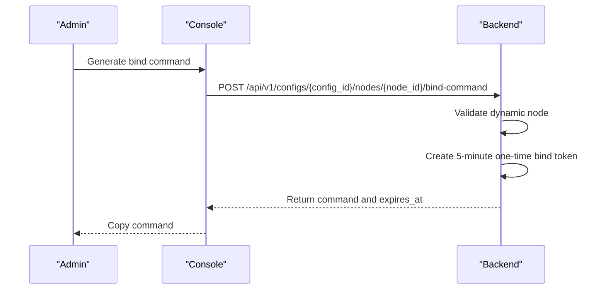
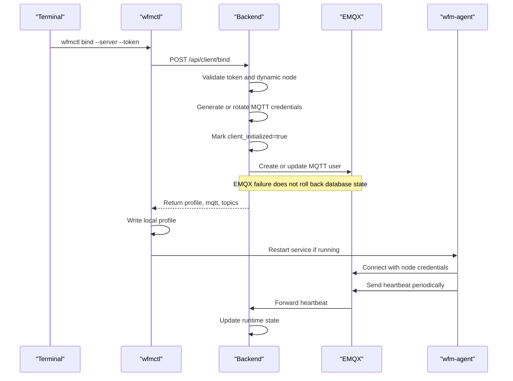
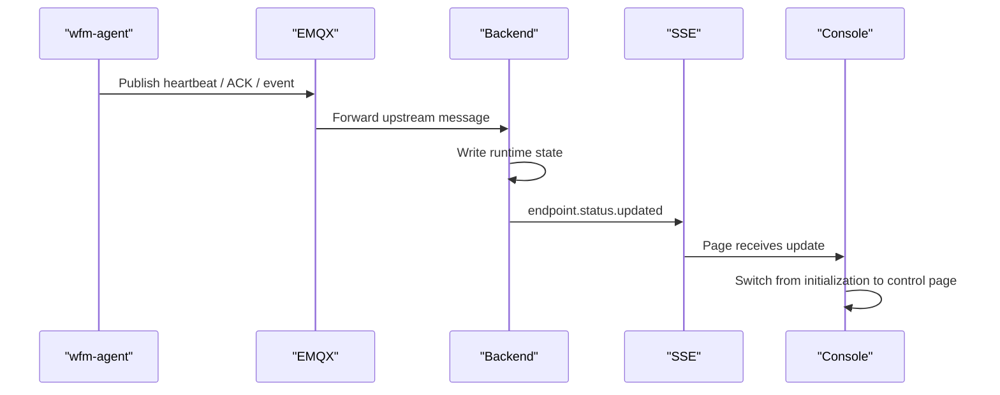
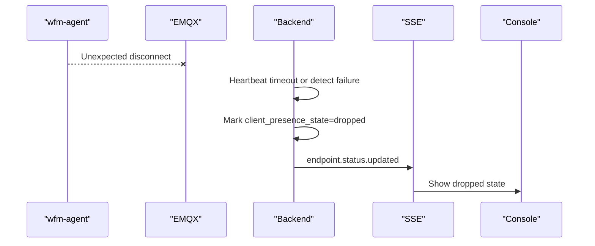
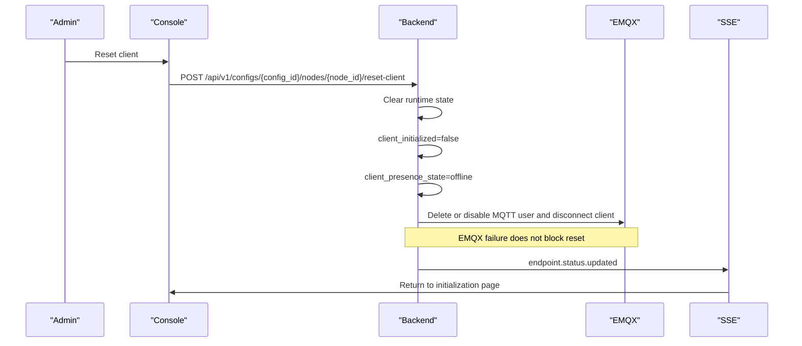

# Client Lifecycle

This page describes the dynamic node lifecycle: download, install, bind, online state, disconnects, reset, and control page transitions. Static nodes do not expose bind commands or client control.

## Control Page Entry

The node control page depends on `client_initialized`:

| State | Page |
| --- | --- |
| `client_initialized=false` | Client initialization page: download, install, bind. |
| `client_initialized=true` | Control page: status, logs, config push, tunnel start/stop. |

`client_initialized=true` only means a client has completed binding before. It does not mean the client is currently online. Online state is projected by the backend from MQTT signals.

## Initialization Steps

The initialization page has three steps:

1. Download the client.
2. Install the client service.
3. Generate and copy the node bind command.

After install, the user runs the bind command in a terminal. After binding, the client writes a local profile and connects to MQTT.

## Bind Command Generation

Rules:

- Bind tokens expire after 5 minutes by default.
- A bind token can be used successfully only once.
- Changing a node to static, resetting the client, or regenerating the token invalidates old tokens.

## Successful Bind

The database remains the source of truth. If EMQX is temporarily unavailable, binding still writes database state; synchronization reconciles EMQX later.

## Page Switch After Online Signal

The frontend should not guess this transition. It follows backend state and SSE events.

## Unexpected Disconnect

Unexpected disconnects do not return the page to initialization. The node is still initialized; it is only currently unreachable.

## Reset Client

After reset, old MQTT credentials must not continue working. The client must bind again.

## Dynamic to Static

When a dynamic node becomes static, the backend clears binding permissions, clears runtime state, marks the node offline, disables EMQX credentials, and pushes status updates.

Static nodes do not show bind commands and do not support endpoint control.

## Final State Semantics

| State | Rule |
| --- | --- |
| online | Any recent reachable signal exists and no newer offline signal exists. |
| dropped | All reachable signals exceed TTL, or detect fails/times out without another recent signal. |
| offline | Never bound, will message received, client reset, node changed to static, or permission revoked. |

Reachable signals include heartbeat, detect ACK, control ACK, info ACK, config push ACK, and non-offline events.

## Version and Config Projection

Client version comes from bind requests and detect ACKs. The backend stores it in `node_client_state`, and the frontend only displays backend fields.

WG config version state is calculated by the backend:

- `latest`: confirmed client state matches staged server state.
- `pending`: config has not been pushed or confirmed state is behind.

## Diagnostics

When the user clicks "show WG information":

1. Backend publishes `wg_show` to the `info` topic.
2. Client runs raw `wg` or `awg`.
3. `info/ack` only marks completion or failure.
4. stdout/stderr is sent through `event`.
5. Backend writes control logs and pushes SSE events.

Raw `wg` / `awg` output is diagnostic only. It can include all host interfaces and does not participate in current profile runtime projection.
