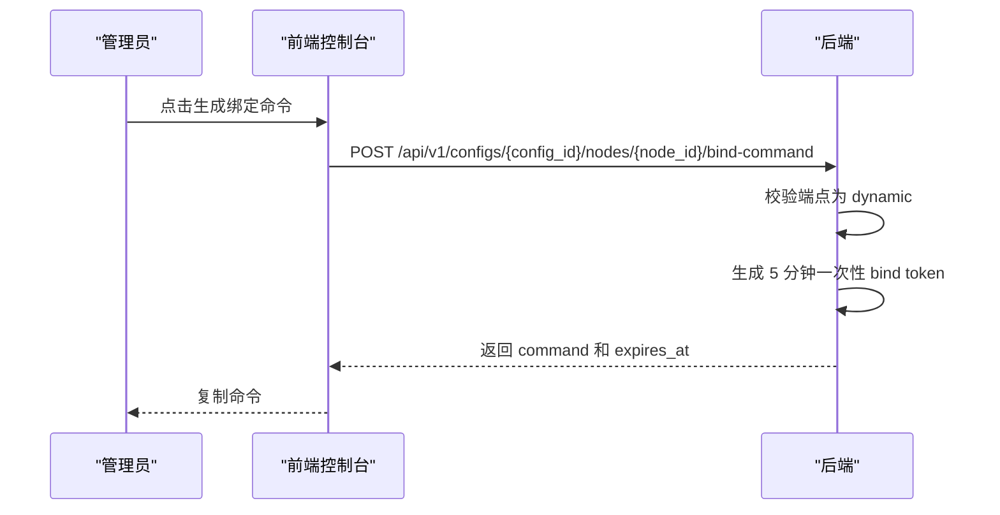
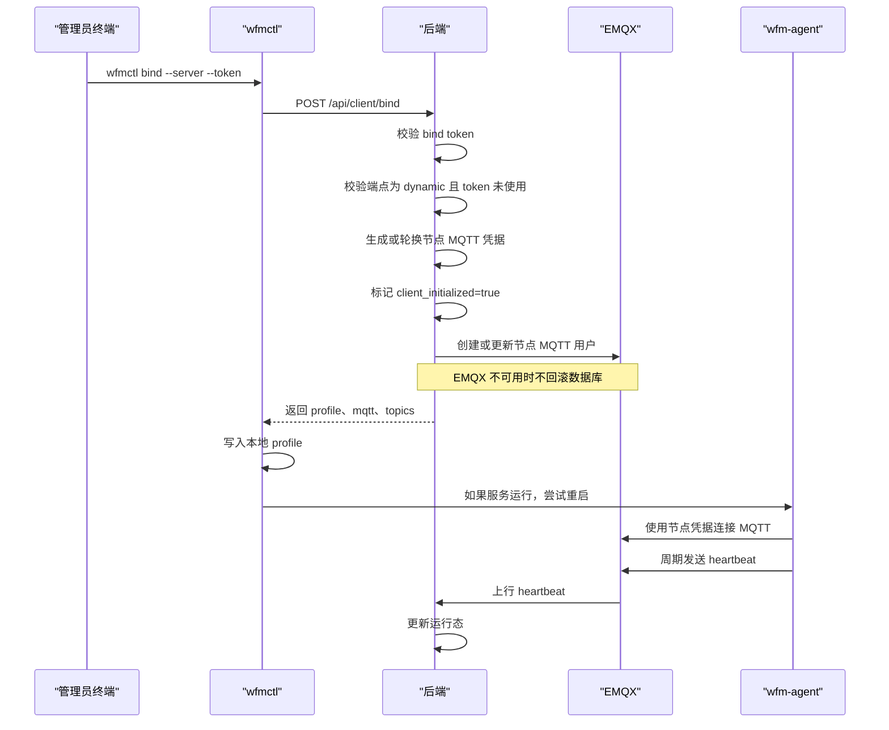
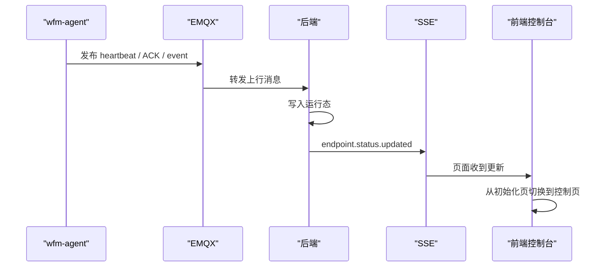
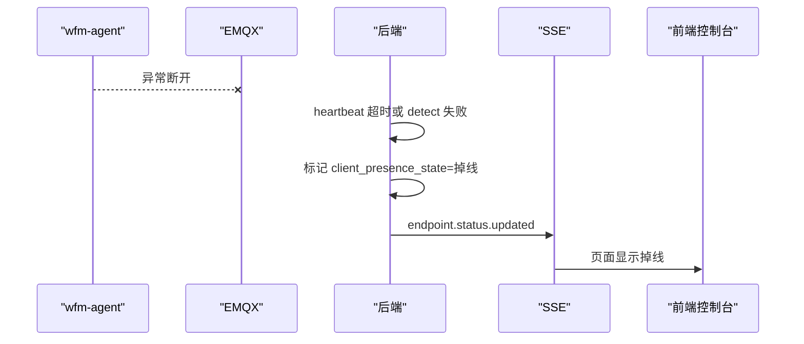
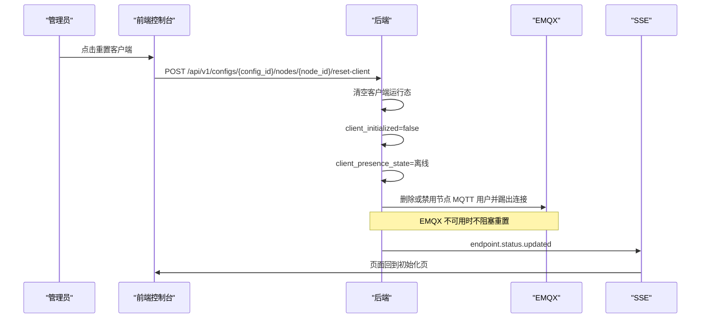

# 客户端接入时序

本页描述动态端点从下载安装到绑定、上线、掉线、重置的完整时序。静态端点不显示绑定命令，也不进入客户端控制链路。

## 页面入口

动态端点进入端点控制页时，页面根据 `client_initialized` 决定展示内容：

| 状态 | 页面 |
| --- | --- |
| `client_initialized=false` | 客户端初始化页：下载、安装、绑定。 |
| `client_initialized=true` | 真正控制页：状态、日志、下发配置、启停隧道。 |

`client_initialized=true` 只表示该端点完成过客户端接入，不代表当前一定在线。在线状态由服务端根据 MQTT 信号投影。

## 初始化页步骤

初始化页按三步组织：

1. 下载客户端。
2. 安装客户端服务。
3. 生成端点绑定命令并复制。

安装完成后，用户在终端执行绑定命令。绑定成功后，客户端写入 profile 并连接 MQTT。

## 生成绑定命令

约束：

- bind token 默认有效期 5 分钟。
- bind token 只能成功使用一次。
- 节点转静态、重置客户端或重新生成 token 后，旧 token 必须失效。

## 绑定成功

后端数据库是唯一真相。EMQX 临时不可用时，绑定数据仍然落库；EMQX 恢复后由同步逻辑补齐用户和授权。

## 上线后页面切换

页面切换不由前端猜测完成，而由后端返回的端点状态和 SSE 事件驱动。

## 异常掉线

异常掉线不会自动回到初始化页。因为该端点仍然是已初始化端点，只是当前连接不可达。

## 主动重置客户端

重置后旧 MQTT 凭据不能继续使用。客户端必须重新执行绑定命令。

## 动态端点改静态端点

动态端点改成静态端点时，后端需要：

- 清空绑定权限。
- 清空运行态。
- 标记 `client_initialized=false`。
- 标记 `client_presence_state=离线`。
- 删除或禁用 EMQX 用户。
- 推送端点状态事件。

静态端点不显示绑定命令，也不具备端点控制能力。

## 最终状态语义

控制台对客户端保留三态：

| 状态 | 规则 |
| --- | --- |
| 在线 | 任一近期可达信号存在，且没有更新的离线信号。 |
| 掉线 | 所有可达信号超过 TTL，或 detect 失败/超时且没有其它近期可达信号。 |
| 离线 | 未绑定、收到遗言、重置客户端、节点转静态、权限回收。 |

有效可达信号：

- heartbeat
- detect ACK
- control ACK
- info ACK
- config push ACK
- 非 `offline` event

客户端每 30 分钟发送 heartbeat。服务端在线 TTL 必须大于该周期，避免一次心跳丢失导致误判。

## 版本和配置投影

客户端版本来自：

- bind 请求。
- detect ACK。

服务端收到后写入 `node_client_state`，前端读取后端聚合后的版本字段，不自行判断。

WG 配置版本状态由服务端根据 staged 同步态和客户端 confirmed 下发态计算：

- `latest`：客户端 confirmed 下发态等于服务端 staged 同步态。
- `pending`：尚未下发，或客户端 confirmed 下发态落后。

前端只展示该状态，不自行计算。

## 诊断信息

用户点击“查看 WG 信息”时：

1. 服务端向 `info` topic 发布 `wg_show`。
2. 客户端执行裸 `wg` 或 `awg`。
3. `info/ack` 只表示命令完成或失败。
4. stdout/stderr 通过 `event` 上报。
5. 后端写入控制日志并通过 SSE 推送到页面。

裸 `wg` / `awg` 输出允许包含主机上所有接口，仅作为诊断信息，不参与当前 profile 运行态投影。
