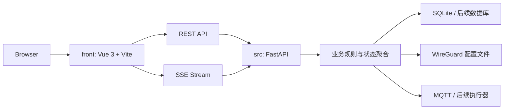

# 实时通道 SSE 重构方案

## 目标

本方案用于替换当前基于 WebSocket 的页面实时推送链路，统一改为 SSE。

重构目标：

- 彻底移除浏览器侧 WebSocket 依赖。
- 保留当前“首屏 REST + 后续实时增量”的交互模式。
- 优先提升手机浏览器和弱网络环境下的稳定性。
- 前端继续不承载业务逻辑，只消费后端快照和增量事件。
- 为后续对外 API、MCP 聚合和反向代理部署保留清晰边界。

本次方案只覆盖浏览器后台管理端，不涉及客户端 Agent。

## 为什么放弃 WebSocket

当前实时需求本质上是单向推送：

- 系统状态
- 配置列表
- 配置概览
- 节点工作区
- Mesh 工作区
- 配置预览
- 端点运行状态
- 控制日志
- 设置页快照和 MQTT 参数

这些页面需要的是“后端持续推送状态”，而不是浏览器与服务端的双向会话控制。

WebSocket 当前暴露出的主要问题：

- 移动端浏览器下连接异常关闭频繁。
- 断开时多为 `1006`，说明关闭并不优雅。
- 代理、调试环境、浏览器节电策略都会放大不稳定性。
- 当前需求并不充分利用 WebSocket 的双向能力，复杂度与收益不匹配。

SSE 更适合当前场景：

- 原生语义就是服务端单向推送。
- 基于 HTTP，代理和部署链路更简单。
- 浏览器断线重连行为更自然。
- 前端状态管理模型更清晰，不需要自行维护复杂 WebSocket 状态机。

## 总体架构



重构后的职责：

- REST 负责首屏快照、写操作、手动刷新类动作。
- SSE 负责页面状态增量同步。
- 前端只维护一个共享的 SSE 连接管理器。
- 后端继续作为业务真相来源，统一发布实时事件。

## 通道设计

## 统一入口

建议使用单一 SSE 入口：

```text
GET /api/v1/events/stream
```

不再保留 `/api/v1/ws/events` 作为浏览器后台的主实时入口。

后续如果确实存在双向实时控制需求，再单独为客户端 Agent 或特殊控制场景保留 WebSocket，不与后台页面共用。

## 数据格式

SSE 采用标准事件结构：

```text
event: system.status.updated
id: 202604170001
data: {"summary": {...}, "services": {...}}
```

字段约定：

- `event`：事件类型
- `id`：事件序号或事件 ID
- `data`：JSON 载荷

## 保活策略

服务端周期发送注释型 heartbeat，避免代理或浏览器把空闲连接直接回收：

```text
: keepalive

```

建议间隔：

- `15s` 到 `20s`

这个 heartbeat 只用于链路保活，不参与业务状态渲染。

## 鉴权方案

这里是本次重构里最关键的架构点之一。

浏览器原生 `EventSource` 不能方便地附带 Bearer Token Header，因此不建议直接使用原生 `EventSource + query token`。

推荐方案：

- 前端使用基于 `fetch` 的 SSE 客户端实现。
- 仍然通过：

```text
Authorization: Bearer <access_token>
```

传递登录态。

推荐实现方向：

- 使用 `@microsoft/fetch-event-source`
- 或自行基于 `fetch + ReadableStream` 封装 SSE 解析器

这样做的好处：

- 继续复用现有 auth 模型
- 不需要把 token 暴露到 URL 查询参数
- 与现有 REST 鉴权方式保持一致

本方案默认采用：

- `fetch` 风格 SSE
- Bearer Token Header 鉴权

不建议：

- `?token=` 查询参数长期保留在 SSE URL 中
- 为了 SSE 单独把认证改成 Cookie Session

## 事件模型

## 基本原则

- 首屏先走 REST 快照。
- SSE 连接建立后，只负责推送增量和必要的快照刷新事件。
- 不追求浏览器端事件重放。
- 如果连接重建，前端重新拉一次当前页面快照即可。

这意味着首版 SSE 不强依赖 `Last-Event-ID` 的完整回放能力。

建议事件分为两类：

### 快照刷新事件

用于告诉前端某个页面级资源已经更新，可直接替换当前状态。

例如：

- `config.list.updated`
- `config.overview.updated`
- `node.workspace.updated`
- `node.apply.updated`
- `mesh.workspace.updated`
- `settings.mqtt.updated`
- `snapshot.list.updated`
- `system.status.updated`

### 流式增量事件

用于日志、运行状态等连续变化内容。

例如：

- `control.log.created`
- `control.log.updated`
- `endpoint.status.updated`

## 时间同步策略

当前 `system.clock.tick` 每秒推送一次，虽然简单，但会制造高频事件。

SSE 重构后建议改为：

1. 建立连接时后端返回一次服务端时间基线。
2. 前端在本地按秒推进显示。
3. 后端每 `30s` 或 `60s` 推送一次校时事件。

建议事件：

- `system.clock.sync`

载荷：

- `timestamp`

这样能满足系统时间显示，又能显著减少实时通道压力。

## 页面映射

### 首页

首屏：

- `GET /api/v1/configs`
- `GET /api/v1/system/status`

实时：

- `config.list.updated`
- `system.status.updated`

### 配置概览页

首屏：

- `GET /api/v1/configs/{config_id}/overview`
- `GET /api/v1/configs/{config_id}/tags`

实时：

- `config.overview.updated`

### 节点公共头

首屏：

- `GET /api/v1/nodes/{node_id}`

实时：

- `node.workspace.updated`

### Mesh 网络页

首屏：

- `GET /api/v1/configs/{config_id}/nodes/{node_id}/mesh-workspace`

实时：

- `mesh.workspace.updated`

### 配置预览页

首屏：

- `GET /api/v1/configs/{config_id}/nodes/{node_id}/sync-status`
- `GET /api/v1/configs/{config_id}/nodes/{node_id}/wg-preview`
- `GET /api/v1/configs/{config_id}/nodes/{node_id}/applied-conf`

实时：

- `node.apply.updated`

### 端点控制页

首屏：

- `GET /api/v1/configs/{config_id}/nodes/{node_id}/endpoint/status`
- `GET /api/v1/configs/{config_id}/nodes/{node_id}/endpoint/logs`

实时：

- `endpoint.status.updated`
- `control.log.created`
- `control.log.updated`

### 设置页

首屏：

- `GET /api/v1/settings/mqtt`
- `GET /api/v1/backups/list`

实时：

- `settings.mqtt.updated`
- `snapshot.list.updated`

### 系统状态页

首屏：

- `GET /api/v1/system/status`

实时：

- `system.status.updated`
- `system.clock.sync`

## 前端重构方案

## 实时层

前端统一收束为单个共享 SSE 管理器：

- 只允许一个连接实例
- 页面通过订阅事件类型拿数据
- 页面退出时只移除监听器，不主动关闭全局流

建议新职责：

- `useRealtime` 重构为 `useEventStream`
- 不再暴露 WebSocket readyState 风格语义
- 改为暴露：
  - `connected`
  - `connecting`
  - `lastEventAt`
  - `lastError`
  - `reconnectCount`

## 重连策略

SSE 层由前端做轻量控制：

- 首次连接失败：指数退避重连
- 连接中断：指数退避重连
- 可见性变化：不主动断线
- 页面恢复：只检查当前流是否存活，不强制换线

原则：

- 只有连接真正关闭时才重连
- 不允许多个入口同时抢占连接控制权
- 不允许页面组件私自 `close + reconnect`

## 页面层

页面不再感知底层 WebSocket 事件。

页面只做三件事：

1. 首屏拉 REST
2. 订阅自己需要的 SSE 事件
3. 将事件载荷直接替换到页面状态

前端不得自行拼接后端未提供的业务结果。

## 后端重构方案

## 统一发布器

后端继续保留统一实时发布服务，但输出通道从 WebSocket 改成 SSE 可消费的事件流。

服务层仍然负责：

- 发布配置列表更新
- 发布配置概览更新
- 发布节点工作区更新
- 发布 Mesh 工作区更新
- 发布配置预览更新
- 发布端点状态更新
- 发布日志更新
- 发布系统状态更新
- 发布设置页更新

## SSE 接口实现

建议在 FastAPI 中提供：

```text
GET /api/v1/events/stream
```

实现要点：

- 先鉴权
- 建立每连接独立订阅队列
- 按 SSE 标准输出 `event / id / data`
- 定时输出 `: keepalive`
- 客户端断开时及时清理订阅

输出头建议包括：

- `Content-Type: text/event-stream`
- `Cache-Control: no-cache`
- `Connection: keep-alive`
- `X-Accel-Buffering: no`

其中 `X-Accel-Buffering: no` 用于避免 Nginx 等代理缓冲 SSE。

## 事件发布原则

- 页面需要完整替换时，直接发布页面级快照。
- 局部连续变化时，发布增量事件。
- 不把展示文案塞进事件。
- 不把前端临时交互状态塞进事件。

## 与现有 REST 的关系

SSE 不替代 REST。

REST 仍然负责：

- 首屏数据
- 表单提交
- 创建、删除、修改
- 手动操作命令
- 大对象下载

SSE 只负责：

- 服务端主动推送更新
- 减少用户手动刷新
- 降低高频轮询

## 对认证模块的影响

当前认证模块总体可以保留：

- `POST /api/v1/auth/login`
- `GET /api/v1/auth/state`
- Bearer Token

需要调整的只有实时通道鉴权方式：

- 从 `query token` 改为 `Authorization` Header

这样前后端认证语义会更统一。

## 与反向代理和生产部署的关系

SSE 对生产环境的要求：

- 代理层不能缓冲事件流
- 空闲超时要高于 heartbeat 周期
- gzip 不应破坏流式输出

部署关注点：

- Nginx/Traefik/Caddy 需要显式支持 `text/event-stream`
- 代理超时要放宽
- Docker 部署不需要再为浏览器后台承担 WebSocket 特殊兼容处理

## 迁移步骤

建议按下面顺序实施：

### 第一阶段：文档与接口定稿

- 定稿 SSE 入口、事件名、载荷结构
- 明确哪些页面使用页面级快照，哪些页面使用增量事件
- 确定时间同步从 `system.clock.tick` 改为 `system.clock.sync`

### 第二阶段：后端双栈过渡

- 保留现有事件发布服务
- 新增 SSE 流接口
- 同一份事件同时可被 WebSocket 和 SSE 消费

这一阶段仅用于平滑迁移，避免一次性切全站。

### 第三阶段：前端切换

- 新增 `useEventStream`
- 页面逐步从 WebSocket 改为 SSE
- 移除当前 WebSocket 状态机和断线提示逻辑

### 第四阶段：下线 WebSocket

- 管理后台完全切到 SSE
- 删除 `/api/v1/ws/events` 在浏览器后台中的使用
- 保留或删除该接口，取决于后续是否还有 Agent 或双向控制需求

## 本次重构建议的明确取舍

为了尽快稳定系统，建议首版采用以下取舍：

- 使用 SSE，不保留浏览器后台 WebSocket。
- 使用 Bearer Token Header，不走 URL token。
- 使用单一全局 SSE 流，不按页面拆多条连接。
- 不实现事件重放，断线后重新拉当前页面快照。
- 系统时间改为“后端校时 + 前端本地走秒”，不再每秒推流。
- 页面优先消费后端快照，不把浏览器变成业务拼装器。

## 评估结论

从当前系统的真实需求、移动端稳定性和后续维护成本看，后台管理端全面改为 SSE 是合理的。

理由：

- 当前实时需求以单向推送为主。
- WebSocket 在移动端浏览器上的异常关闭已经成为稳定性成本。
- SSE 更符合当前业务模型，也更容易通过标准 HTTP 链路部署。

建议下一步在你确认后，再进入代码实施阶段。
