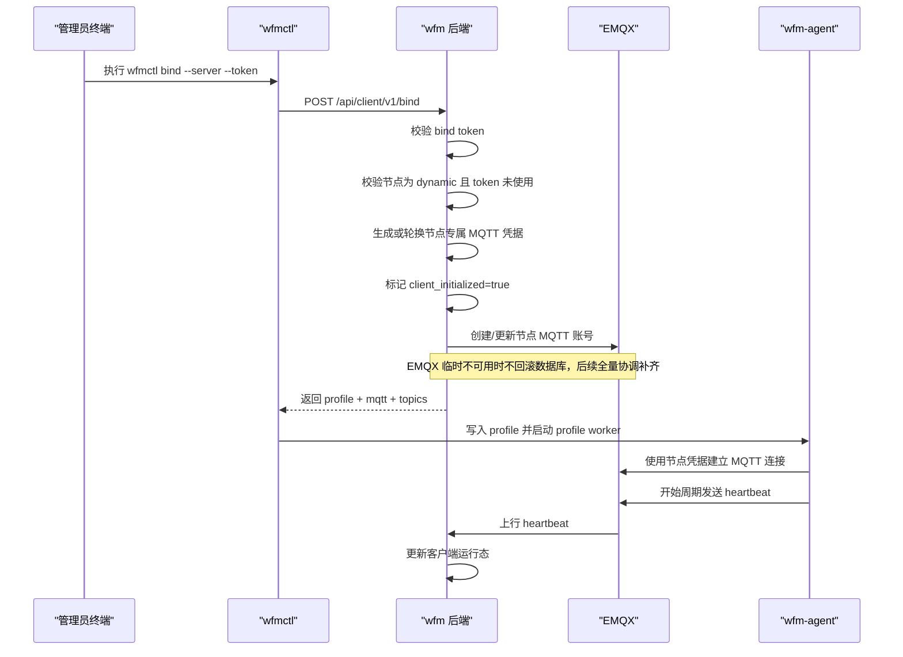
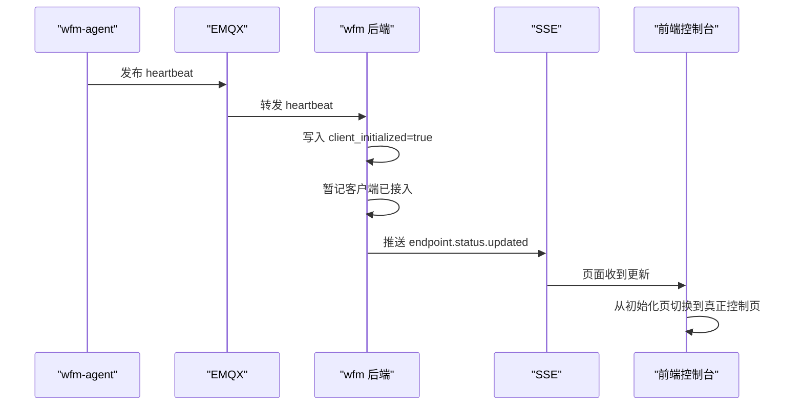
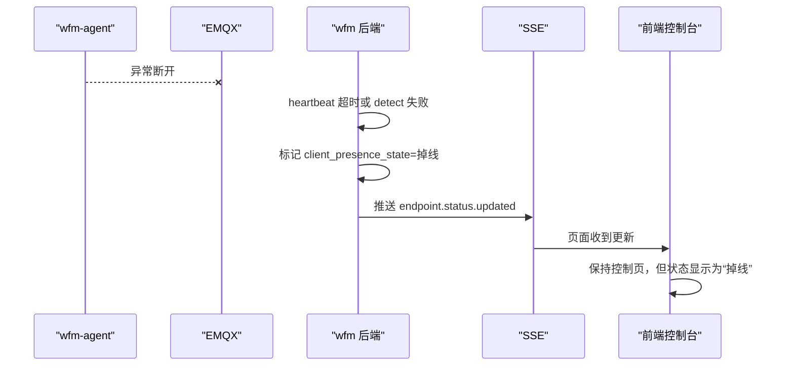
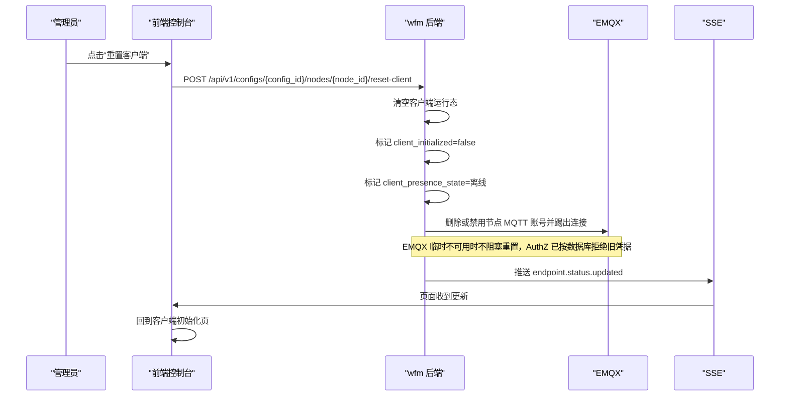
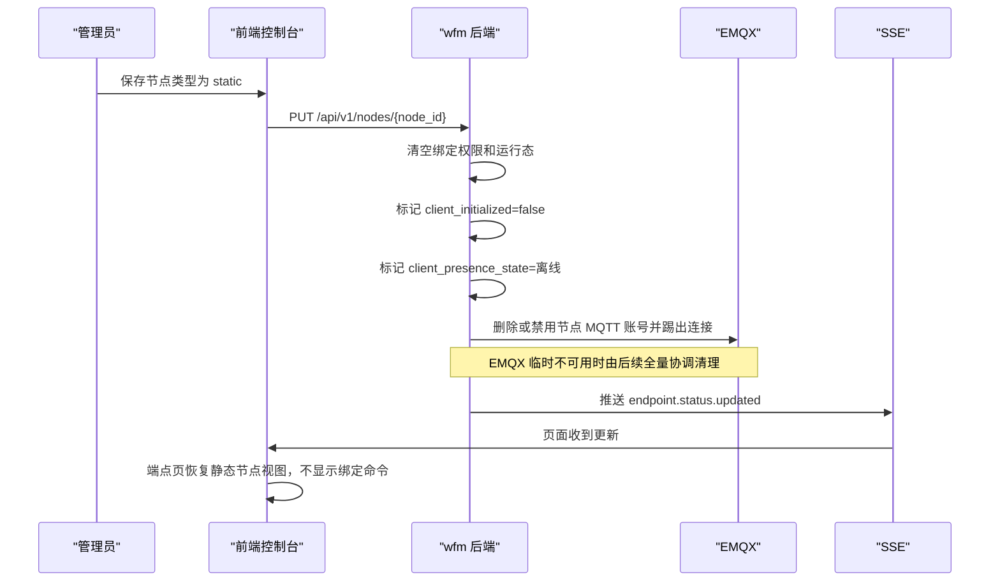

# 客户端接入时序设计

## 目标

本文件只描述动态节点客户端接入、绑定、上线、异常掉线和重置客户端的时序。

它和 [客户端设计](D:/wenjian/stepsave/project/wg-free-mesh/docs/客户端设计.md) 与 [MQTT消息协议设计](D:/wenjian/stepsave/project/wg-free-mesh/docs/MQTT消息协议设计.md) 配套使用。

## 页面入口时序

动态节点进入端点控制页时，默认不直接显示真正控制页，而是先进入客户端初始化页。

初始化页包含：

1. 第一步：下载客户端
2. 第二步：安装客户端服务
3. 第三步：生成端点绑定命令并复制

当后端返回 `client_initialized=true` 后，页面切换到真正控制页。

静态节点不显示绑定命令能力。

## 一次性绑定命令生成

约束：

- token 默认有效期 5 分钟
- token 只能成功使用一次
- 节点转静态或执行重置客户端后，旧 token 必须失效

## bind 成功时序

## 客户端上线后控制台页面切换

## 异常掉线时序

规则：

- 异常掉线不自动回到初始化页
- 因为该节点仍然是已初始化节点，只是当前连接异常

## 主动重置客户端时序

## 动态节点改静态节点时序

## 控制台最终页面规则

### 动态节点

- `client_initialized=false`
  - 显示客户端初始化页
- `client_initialized=true`
  - 显示真正控制页

说明：

- `client_initialized=true` 只表示该节点已完成客户端接入，不等于当前状态一定是“在线”。
- 真正在线由服务端统一投影：heartbeat、detect ACK、control ACK、info ACK、config push ACK、generic ACK 或非 `offline` 的 event 任一近期可达信号都可证明在线。

### 静态节点

- 永远不显示绑定命令
- 端点控制能力保持禁用或只读占位

## 最终状态语义

控制台对客户端只保留三态：

- `在线`
- `掉线`
- `离线`

投影规则：

- 首次未绑定：`离线`
- 收到遗言：`离线`
- 重置客户端、节点转静态、权限回收：`离线`
- 所有有效可达信号都超过服务端 TTL：`掉线`
- detect 失败或 detect 返回综合异常，且没有其它近期可达信号：`掉线`
- 任一近期可达信号存在，且没有更新的离线信号：`在线`

客户端版本投影：

- `wfmctl bind` 请求携带 `hostname`、`platform`、`client_version`。
- 服务端在绑定成功时写入 `node_client_state.client_hostname`、`client_platform`、`client_version`。
- 端点控制页读取服务端聚合后的 `client_version_label`，不在前端自行判断平台和版本。

WG 配置版本投影：

- 服务端根据节点同步态与客户端 confirmed 下发态的差异计算 `wg_config_version_state`。
- `latest` 表示客户端 confirmed 下发态已等于服务端 staged 同步态。
- `pending` 表示尚未下发，或客户端 confirmed 下发态已落后。
- 前端只展示该状态，不自行计算“最新 / 待同步”。

在线与 WG 状态投影：

- 客户端每 30 分钟发布一次 `heartbeat`，payload 只包含 `client_online`、`wg_online`。
- 服务端在线 TTL 为 90 分钟，并且不只依赖 heartbeat；控制 ACK、info ACK、配置 ACK、detect ACK 和非离线 event 都会刷新 `last_reachable_at`。
- 前端存在 SSE 订阅时，服务端每 2 分钟向启用配置中已绑定客户端的动态节点发布 `detect`。
- `detect/ack` 只包含 `client_online`、`wg_online` 和执行状态。
- heartbeat、detect 和 ACK/event 是独立来源，最终客户端在线状态和 `wg_runtime_state` 由服务端投影，前端只展示。
- 静态节点、未初始化动态节点、客户端离线或掉线时，WG 状态必须显示为未知。

诊断信息投影：

- 用户在端点控制页点击“查看 WG 信息”时，服务端向 `info` topic 发布 `wg_show`。
- `info/ack` 只表示命令执行完成或失败。
- `wg` / `awg` 诊断输出统一通过 `event` topic 上报，并展示在命令行回显区。
