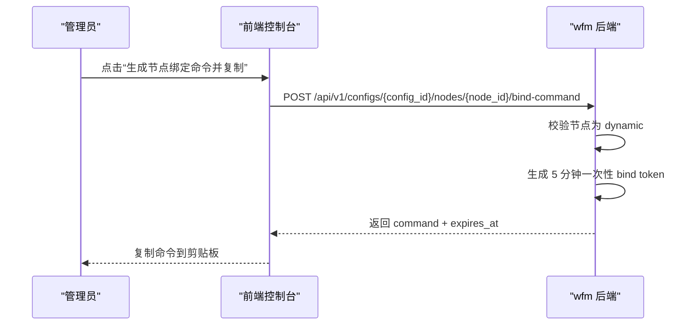
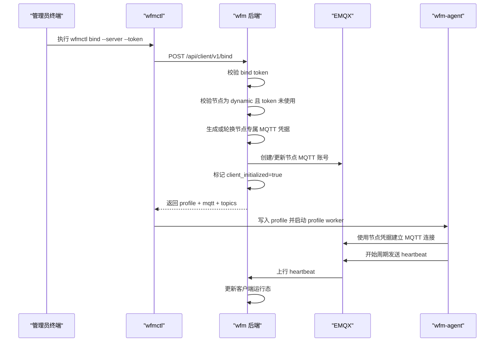
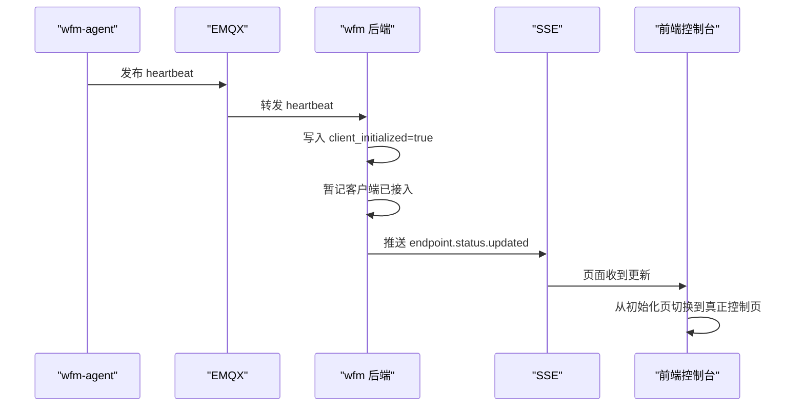
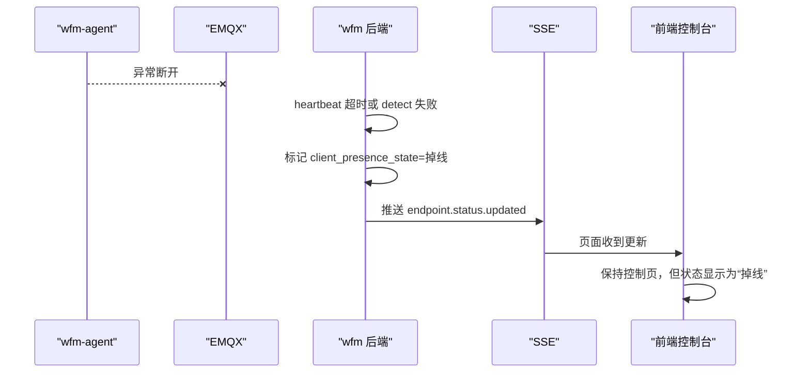
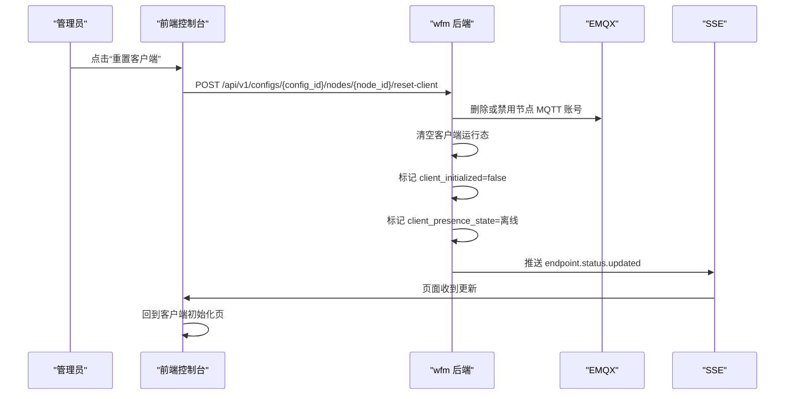
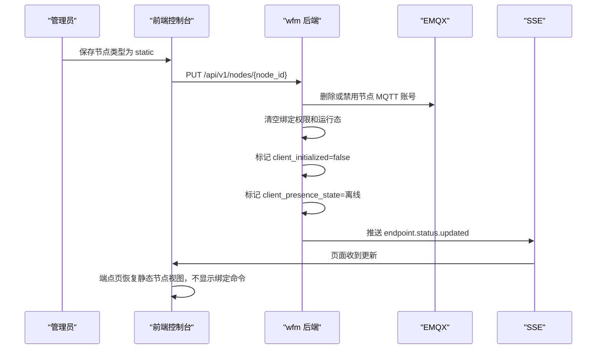

# 客户端接入时序设计

## 目标

本文件只描述动态节点客户端接入、绑定、上线、异常掉线和重置客户端的时序。

它和 [客户端设计](D:/wenjian/stepsave/project/wg-free-mesh/docs/客户端设计.md) 与 [MQTT消息协议设计](D:/wenjian/stepsave/project/wg-free-mesh/docs/MQTT消息协议设计.md) 配套使用。

## 页面入口时序

动态节点进入端点控制页时，默认不直接显示真正控制页，而是先进入客户端初始化页。

初始化页包含：

1. 第一步：下载客户端
2. 第二步：生成节点绑定命令并复制

当后端返回 `client_initialized=true` 后，页面切换到真正控制页。

静态节点不显示绑定命令能力。

## 一次性绑定命令生成

约束：

- token 默认有效期 5 分钟
- token 只能成功使用一次
- 节点转静态或执行重置客户端后，旧 token 必须失效

## bind 成功时序

## 客户端上线后控制台页面切换

## 异常掉线时序

规则：

- 异常掉线不自动回到初始化页
- 因为该节点仍然是已初始化节点，只是当前连接异常

## 主动重置客户端时序

## 动态节点改静态节点时序

## 控制台最终页面规则

### 动态节点

- `client_initialized=false`
  - 显示客户端初始化页
- `client_initialized=true`
  - 显示真正控制页

说明：

- `client_initialized=true` 只表示该节点已完成客户端接入，不等于当前状态一定是“在线”。
- 真正在线仍由 `heartbeat + detect` 共同决定。

### 静态节点

- 永远不显示绑定命令
- 端点控制能力保持禁用或只读占位

## 最终状态语义

控制台对客户端只保留三态：

- `在线`
- `掉线`
- `离线`

投影规则：

- 首次未绑定：`离线`
- 收到遗言：`离线`
- 重置客户端、节点转静态、权限回收：`离线`
- heartbeat 超时：`掉线`
- detect 失败或 detect 返回综合异常：`掉线`
- heartbeat 正常且 detect 成功：`在线`
