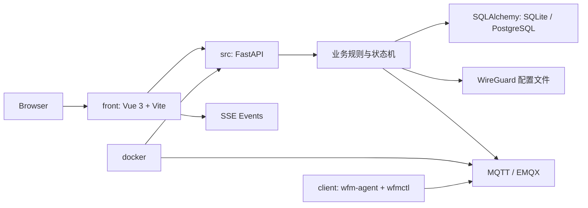

# 总体架构

## 架构方向

系统分为五个主要部分：

## 前端职责

前端负责：

- 页面展示
- 表单输入
- 操作反馈
- REST 请求
- SSE 实时订阅

前端不负责：

- WireGuard 配置生成
- Mesh 最终有效性判断
- 配置是否可同步、可下发的最终判断
- 敏感字段签名和安全校验
- 关键业务状态计算
- 后续对外 API 或 MCP 需要复用的业务推导

## 后端职责

后端负责：

- 认证与会话
- 配置、节点、Peer Link 建模
- WireGuard 配置生成
- Mesh 工作区视图聚合
- 配置三态管理
- 运行态聚合
- 端点控制日志
- 备份恢复
- 系统状态聚合
- 外部 API 与 MCP 聚合可复用的业务用例

## 数据层

- 后端使用 SQLAlchemy 统一数据访问入口。
- `WFM_DATABASE` 是数据库连接的唯一部署入口。
- 默认本地开发使用 SQLite：`sqlite:///./data/wg_free_mesh.db`。
- Docker 提供 SQLite 与 PostgreSQL 两套目录化启动方式。
- Alembic migration 位于 `src/migrations/`。
- 备份恢复使用应用级快照，不直接复制数据库物理文件，因此可用于不同数据库之间迁移。

## 配置三态

系统围绕配置文档生成工作流运行，配置至少有三个形态：

- 系统态：
  用户在系统中操作后，由系统根据配置、节点、链路自动生成的配置文本。
- 同步态：
  系统准备同步和下发的配置文本。系统态原则上自动同步到同步态，但用户可以手动编辑，也可以在节点级关闭自动同步。
- 下发态：
  同步态最终投递到客户端的配置结果。

增加同步态的目的，是为用户保留手动调整配置文件的空间。

配置级自动同步只定义新建节点时的默认值，不作为配置范围内的总开关；已有节点是否自动同步以节点自己的开关为准。

## 页面信息架构原则

- 页面布局和主操作流向以当前配置详情、节点工作台、Mesh 和端点控制页面为准
- 配置详情页是主工作台
- 节点、Mesh、同步、端点控制都应围绕当前配置组织

## 部署原则

本地开发：

- 前端和后端分别启动
- 前端直连后端 API，后端开发期 CORS 可开放到前端地址

生产部署：

- 前端先构建 `dist`
- `dist` 复制进后端镜像
- FastAPI 同时提供 API 和静态页面
- Docker 启动入口按数据库类型放在 `docker/sqlite` 和 `docker/postgres`
